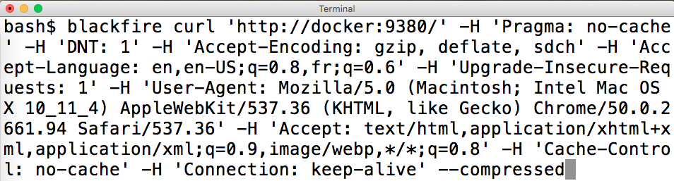

  <h2 style="margin:30px auto 50px 0px; font-size:1.8em; font-weight:bold; width: 90%; text-align: center">
    Using Blackfire.io to profile Drupal loading time
  </h2>
  <table style="width: 90%"><tr>
    <td style="font-size:0.7em; text-align: center; width:50%;">
      
Alex Dergachev

      
 alex@evolvingweb.ca 

      
 @dergachev on twitter, github, drupal.org 

    </td>
    <td style="font-size:0.7em; text-align: center; width:50%;">
      
Dave Vasilevsky

      
 vasi@evolvingweb.ca 

      
 twitter.com/djvasi 

      
 @vasi on github, drupal.org 

    </td>
  </tr></table>

  

--end--

## About Evolving Web

* Drupal development, consulting and training since 2007
* Very involved with the Drupal community
* Specialties
  * Infrastructure
  * Multilingual content
  * Solr search UI
  * Content migration
  * Design and responsive themes
  * Module dev: custom applications built on Drupal
  * Expert Drupal training
* Based in Montreal, clients in Canada and USA

--end--

--end--

## Drupal training program

* Public: Montreal, Ottawa, Toronto, DC Munich, NJ, NYC, Boston, Chiacgo
* Private: Health Canada, Parks Canada, Tourism Quebec, Trent U, McGill U, remote
* Enterprise teams, dev shops, remote

--end--

## About the speakers

--end--

## Outline

* Profiling methodology + philosophy
* Blackfire demo and discussion
* Case studies from our projects

* Intro + motivation
* Profiling methodology + philosophy
* Demo 1: Blackfire UI Tour
* Blackfire basics: Terminology, advantages, installation
* Blackfire features (basic + intermediate)
* Demo 2: Copy as cURL
* Blackfire + Drupal tricks
* Demo 3: Block visibility
* Drupal performance considerations
* Q & A

--end--

# Motivation

--end--

## Why page loading time is SUPER IMPORTANT

* User experience
* Concurrency + scalability
  * "Throw more hardware at it"
* Financial implications
* Google

--end--

## What profiling doesn't measure

* Browser rendering time (HTML, CSS)
* Network issues
* Javascript runtime
* Asset fetching (imgs, fonts)

--end--

--end--

## What profiling measures

* page generation time, CPU + memory info
* blocking operations: SQL + external requests
* what part of your PHP code is slowing things down

--end--

## Why it matters for Drupal

* Drupal core is not exactly lightweight, contrib varies, custom + legacy code
* Why Varnish isn't enough
* We deal with many projects, working on slow ones makes us sad
  * Example scenario of Drupal slowness

--end--

## Profiling gets results, fast

McGill Course Calendar

* 260ms -> 225ms, 13%
* took 1h to locate and fix a problem involve node\_load

--end--

## Profiling gets results, fast

D8 evolvingweb.ca site

* block visibility (80ms out of 450ms, 18%)
* metatag module patch (saves 30ms)
* took 2 hours to identify problems, + 2 days to fix

--end--

## Profiling gets results, fast

Linux Foundation: device certification workflow

* Views over revisions; used xdebug + code study
* Took 3 hours to diagnose + add revision cache
* 980ms -> 420ms

--end--

## Profiling gets results, fast

Client X

* slow redirect (390ms -> 95ms), took an hour to diagnose and fix
* buggy version references\_dialog; 1s to 770ms (23%); 30m to diagnose + fix
* uncached megamenu: 770ms to 480ms, took 2 hours to diagnose, several hours to fix
* helped figure out an unfamiliar codebase

--end--

# Profiling Methodology

--end--

## Define what is "fast enough"

* Identify performance goals: what does it mean to be fast?
* vs. other sites
* vs. user expectations
* front-end vs. back-end
* cached vs. uncached

--end--

# How to profile: M.A.F.I.A.

--end--

## How to profile: Measure

* Define behavior externally (path, logged in, environment, isolation, caching...)
* Use a profiler to analyze internal behavior
  * Figure out what the code is doing
* Variations: pages, site, server env, enable/disable modules, comment out code

--end--

## How to profile: Analyze

* Look for any low hanging fruit, bottlenecks
  * easily cachable requests, bad SQL, blocking requests, unecessary entity loads, watchdog, ...
* Look for signs of overall sluggishness
  * eg swapping, hard-drive contention, network issues, slow/shared server, lack of opcache
* Build a hypothesis on the bottleneck
* Document the scenario, mark it as a reference (baseline)

--end--

## How to profile: Fix

* Make a change
* Compare to baseline
  * In drupal, static caching means removing "slow" code just pushes it to later in request

--end--

## How to profile: Iterate

* Measure again, see if it's fast enough
* If not, keep going!
* Log your runs, later it will be hard to remember all you've changed
* Know when to stop profiling

--end--

## How to profile: Applause

* I couldn't come up with a better "A"

--end--

## Measurement tools

* Front-end: Chrome dev tools
  * YSlow, GTMetrix, WebPageTest.org, Google PageSpeed
* Benchmark: ab (Apache bench), jmeter, siege
* Application Performance Monitoring: newrelic
* PHP Profiling: xhprof / blackfire

--end--

## Blackfire.io

* By SensioLabs, creators of Symfony and Twig
* Not open-source, but free for most uses
* Started as a fork of xhprof...
  * SaaS, easier to manage (but perhaps data risk)
  * Interactive callgraph, better UX
  * Supports comparisons
  * Actively maintained, support for PHP 7
  * Great docs, simpler installation
  * No overhead, you can leave it on all the time

--end--

# Case study: Coursecal

--end--

## Case study: Coursecal

Site for students at McGill university to browse academic courses.

* Tens of thousands of students hit the site at the same time
* Search-driven UI, so can't depend on caching
* Performance is critical!

Let's <a class="presenterlink" href="https://blackfire.io/profiles/131f6f0c-0a90-4ac8-8d7e-7d3e773377ec/graph">profile</a> <a class="presenterlink" href="http://docker4:4569/faculties/engineering/undergraduate/ug_eng_dept_of_bioengineering">a page</a> with Blackfire!

  * Visit page
  * Make a profile
  * Tour the profile: READ NUMBERS
    * Metrics (overall, I/O, cpu, memory...)
      * Are these numbers ok for you?
    * Call graph
      * Hot path -> resources
      * Is this a reasonable amount of time for this function?
    * Function list
      * Calls, excl, incl
      * Expand: metrics (hover)
      * Expand: callees (time restricted to call)
      * Search
  * Let's find a problem function
    * Hot path: theme()
    * moriarty_preprocess_page is long for a preprocess hook!
    * Follow down graph until the time changes significantly
    * We get to loadAcademicFacultyNodes
    * Calling node_load 36 times! Could be multiple

--end--

<h2 class="mini">The slow code</h2>

    NOFADE:public function loadAcademicFacultyNodes($language = '', $key = 'name'){
      $return = array();
      HIGHLIGHT:foreach($this->faculties as $f){
        if ($f->nid && $f->code){
          if (!$language || $f->language === $language){
            HIGHLIGHT:$node = node_load($f->nid);
            if ($key && $f->$key){
              $return[$f->$key] = $node;
            } else {
              $return[] = $node;
            }
          }
        }
      }
      return $return;
    }

Iterate over faculties, load nodes one at a time.

  * Loading nodes one at a time is slow! Should load them all together, to
    minimize the number of DB queries.
  * This code was written for D6, where node\_load\_multiple didn't exist
  * Now that it's in D7, let's fix it.

--end--

<h2 class="mini">A fix</h2>

    NOFADE:public function loadAcademicFacultyNodes($language = '', $key = 'name'){
      $nids = array();
      HIGHLIGHT:foreach($this->faculties as $f){
        if ($f->nid && $f->code){
          if (!$language || $f->language === $language){
            if ($key && $f->$key){
              HIGHLIGHT:$nids[$f->$key] = $f->nid;
            } else {
              $nids[] = $f->nid;
            }
          }
        }
      }

      HIGHLIGHT:$nodes = node_load_multiple($nids);
      $return = array();
      foreach ($nids as $k => $v) {
        $return[$k] = $nodes[$v];
      }
      return $return;
    }

Collect the nids, load all nodes at once.

  * Grab all the node IDs
  * Load the nodes all at once
  * Return data in the expected structure

--end--

## Case study: Coursecal

Saved about 25ms!

A real improvement in under an hour of total work, from profiling to committing a fix.

--end--

## Installing Blackfire

Components:

* `Probe`, a minimalistic PHP extension
* `Agent`, a daemon that connects probe to blackfire servers
* `Companion`, a Chrome extension
* `Client`, command-line client
* `SDK`

--end--

## Installing Blackfire

View [Blackfire Install Docs](https://blackfire.io/docs/24-days/06-installation), which has your API keys, and also instructions for RedHat, OSX, Windows, docker, chef, and more. Install steps on ubuntu:

          wget -O - https://packagecloud.io/gpg.key | sudo apt-key add -
          echo "deb http://packages.blackfire.io/debian any main" | sudo tee /etc/apt/sources.list.d/blackfire.list
          sudo apt-get update
          sudo apt-get install blackfire-agent blackfire-php
          # fill in server-id and server-token
          sudo blackfire-agent --register
          sudo /etc/init.d/blackfire-agent start

          # for command-line use, fill in client-id and client-token
          blackfire config

          # disable xhprof and xdebug php extensions
          # restart apache or php-fpm
--end--

## Blackfire features

* Comparison with baseline profile
* Command line profile trigger (for ajax, cookies, POST requests, web services)
* Profiling command-line / drush commands
  * `blackfire run drush.launcher cc all`
* Sharing profiles publicly

--end--

## Case study: Client X

Complex site. We were asked not to mention the client name.

  * Unfamiliar code base
  * Originally built by people unfamiliar with Drupal

--end--

## The problem

#### Homepage is slow

Let's check it out in Chrome inspector's _Network_ tab:

  That's a pretty slow redirect!

  Our browser is at the path `/en`, so that's what Blackfire would profile
  But we want to profile the redirect itself!

--end--

## Profiling

Use Chrome's _Copy as cURL_:

--end--

## Profiling

Give the results of _Copy as cURL_ to Blackfire:

--end--

## Profiling

Give the results of _Copy as cURL_ to Blackfire:

--end--

## Profiling

Blackfire does its magic:

[And here's our profile](https://blackfire.io/profiles/9b5c779d-f1f9-4bbf-8e6b-bdf3132f7e78/graph)

  We see drupal_render_page taking up time. Why are we rendering a redirect?

  Let's see what's triggering it, search for "goto".
  Find caller, and it's tq_home_preprocess_page.

<a onclick="gotoSlide('#clientx-code');">Next</a>

--end--

## Profiling

Why are we rendering a redirect??

--end--

## Analysis

Let's see what's triggering the redirect:

--end--

## Analysis

Let's see what's triggering the redirect:

--end--

## Analysis

  Whoa, it's a preprocess hook!

--end--

    function tq_home_preprocess_page(&$variables) {
      $tq_init = array_key_exists('tq_lang_init', $_COOKIE) ? $_COOKIE['tq_lang_init'] : null;
      if ($tq_init === null) {
        setrawcookie('tq_lang_init', 1, REQUEST_TIME + 60*60*24*7, '/');
        $languages = language_list();
        $browser_lang = locale_language_from_browser($languages);
        if ($browser_lang !== $GLOBALS['language']->language && drupal_is_front_page()) {
          drupal_goto('<front>', array(
            'language' => $languages[$browser_lang],
          ));
        }
      }
    }

  This code tries to check if the user has been here before, and if not sends the user to their language's landing page.

  It has a lot of problems!
  * If you have cookies blocked/disabled, you just redirect forever!
  * When cookie expires, we try to redirect user even if they've been here before.
  * What we care about now: performance!

--end--

## A fix?

    function tq_home_init() {
      if (drupal_is_cli()) {
        return;
      }

      $tq_init = array_key_exists('tq_lang_init', $_COOKIE) ? $_COOKIE['tq_lang_init'] : null;
      if ($tq_init === null) {
        // ... continue as above

  All the other problems with this code remain.

--end--

## A fix?

At least performance is better:

--end--

## Case study: Client X

* We improved performance, that's nice
* We learned more about an unfamiliar codebase
* Better understanding of future performance problems
  * Eg: Cookies and varnish
--end--

# Blackfire tips

--end--

## Blackfire tips

* Aggregation (10 requests, averaged)
  * Disable aggregation to control for caching and side effects
* Blackfire doesn't keep function arguments (or 1 at most)
* It only keeps significant function calls

--end--

## Blackfire tips

* xdebug conflict
* profiling overhead
  * can't use blackfire to compare PHP 5.5 and 7
* Tradeoff: memory vs time
* Caching and dirty comparisons

--end--

## Diagnostic tips

* References / comparison
* xdebug + read the code
* SDK: enableProbe / disableProbe

--end--

## Case study: evolvingweb.ca

--end--

<h2 class="small">Case study: evolvingweb.ca</h2>

We already upgraded our site to Drupal 8! [http://tiny.cc/midcamp-d8-upgrade](http://tiny.cc/midcamp-d8-upgrade)

D8 is great, we love features like Views in core, CKEditor, Twig…

  We learned a lot about D8, told people all about it.

--end--

<h2 class="small">Case study: evolvingweb.ca</h2>

But it's slower than D7

--end--

<h2 style="border: none;">Blog posts</h2>

Really fast when cached!

No so fast after any node is edited, and D8 invalidates cache tags

--end--

## Uncached requests

Aggregation makes it hard to profile uncached behavior.

Disable page cache: `drush pmu -y page_cache`

Not enough! Let's just reproduce the situation we care about.

  If we edit a node and then profile, Blackfire will have one uncached requests, then nine cached ones.

  We could disable aggregation, but then our measurements will fluctuate too much.

  When we disable the page cache, we still have the dynamic page cache and render cache. And we don't want to invalidate render cache, some elements are still valid.

--end--

## Uncached requests

At the start of each request, pretend a node was edited:

    class EwsiteSubscriber implements EventSubscriberInterface {
      public static function getSubscribedEvents() {
        $events[KernelEvents::REQUEST][] = ['killBlogCache'];
        return $events;
      }

      public function killBlogCache(GetResponseEvent $event) {
        $tags = ['node_list', 'node:239'];
        \Drupal::service("cache_tags.invalidator")->invalidateTags($tags);
      }
    }

Don't commit this! For profiling only

--end--

## Profiling

Now let's see why it's so slow:

That's part of D8 core, and it's taking 117 ms!

--end--

## Analysis

Why so long to figure out what blocks should be visible?

  * We do have a lot of blocks
  * But that's normal for a D8 site, so many things are blocks now! Page titles, menus, footers, views...

--end--

## Analysis

    public function getVisibleBlocksPerRegion(array &$cacheable_metadata = []) {
      // ...
      foreach ($this->blockStorage->loadByProperties(array('theme' => $active_theme->getName())) as $block_id => $block) {
        $access = $block->access('view', NULL, TRUE);
        // ....
      }
    }

To get a list of blocks, Drupal 8:

* Loads every single block in the current theme just to check access
* Checks access using visibility conditions—pretty complex!

  * Iterates through lazy collections many times
  * Merges metadata many times over

--end--

## A fix

Built a module that determines block visibility in one DB query:
[github.com/vasi/block\_access\_records](http://github.com/vasi/block_access_records)

We saved over 80 ms on every uncached request!

* Similar to how `node_access` works, read more about it on our blog.
* Supports Drupal's built-in block visibility conditions

  Caveats:
    * Sites with custom block conditions may need to implement them
    * Not super well tested

--end--

## Blackfire Premium

* Environments (team)
* Data retention
* Assertions + Scenarios + CI + notifications
* Custom metrics
* Recommendations
* Self-hosted version
* Talk to the guys in the Blackfire booth!

--end--

## Calls to Action!

* Please fill in the [feedback form](https://events.drupal.org/neworleans2016/sessions/using-blackfireio-profile-your-loading-time) for this session!
* Join us for Code Sprints
  * Friday, May 13 at the Convention Center
  * First-Time Sprinter Workshop - 9am-12pm in Room 271-273
  * Mentored Core Sprint - 9am-6pm in Room 275-277
  * General Sprints - 9am-6pm in Room 278-282

--end--

## Calls to Action!

* Our blog: [evolvingweb.ca](http://evolvingweb.ca/blog)
* Follow <a href="https://twitter.com/dergachev">@dergachev</a> and <a href="https://twitter.com/djvasi">@djvasi</a> on twitter!
* block\_access\_records: [github.com/vasi/block\_access\_records](https://github.com/vasi/block_access_records)
* Go to the Blackfire booth
