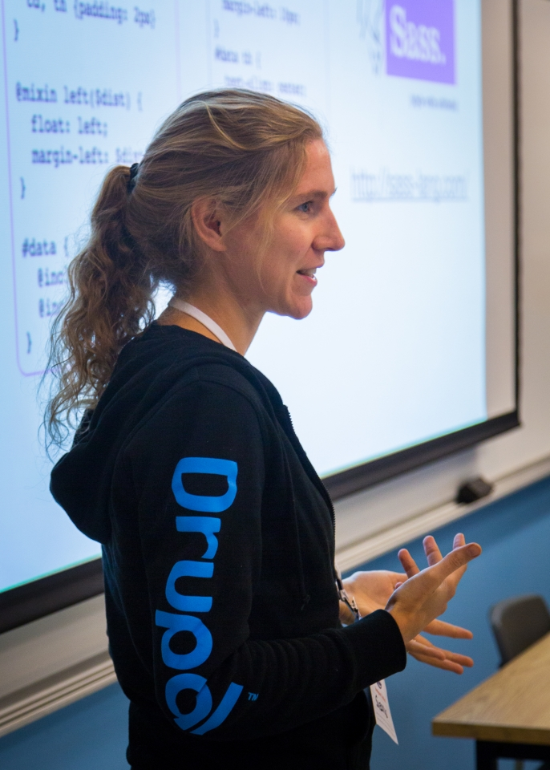

  <h2 style="margin:30px auto 50px 0px; font-size:1.8em; font-weight:bold; width: 90%; text-align: center">
    Using Blackfire.io to profile your loading time
  </h2>
  <table style="width: 90%"><tr>
    <td style="font-size:0.7em; text-align: center; width:50%;">
      
Alex Dergachev

      
 alex@evolvingweb.ca 

      
 github.com/dergachev 

      
 twitter.com/dergachev 

      
 drupal.org/u/evolvingweb 

    </td>
    <td style="font-size:0.7em; text-align: center; width:50%;">
      
Dave Vasilevsky

      
 vasi@evolvingweb.ca 

      
 github.com/vasi 

      
 twitter.com/djvasi 

      
 drupal.org/u/vasi 

    </td>
  </tr></table>

  

--end--

## Outline

A - Intro + motivation

A - Profiling methodology + philosophy

D - Demo 1: Coursecal

D - Blackfire tour

A - Blackfire basics: Terminology, advantages, installation

A - Blackfire features (basic + intermediate)

D - Demo 2: TQ, copy as curl

A - Blackfire + Drupal tricks

V - Demo 3: Block visibility

A - If time allows: General Drupal performance tips

Q & A

--end--

## About Evolving Web

* Drupal development, consulting and training since 2007
* Very involved with the Drupal community
* Specialties
  * Large, scalable infrastructure and deployments
  * Multilingual content management
  * Apache Solr search interfaces
  * Content import and synchronization
  * Custom theme development
  * Custom module development
  * Search engine optimization for Drupal (SEO)
  * Integration with legacy systems
  * Expert Drupal training
* Based in Montreal, clients in Canada and USA

--end--

--end--

## Drupal training program

* Public: Montreal, Ottawa, Toronto, DC Munich, NJ, NYC, Boston
* Private: Health Canada, Parks Canada, Tourism Quebec, Trent U, McGill U
* Enterprise teams, dev shops, remote

--end--

## About the speakers

* Alex co-founded Evolving Web straight out of undergrad
* Dave was there to show us version control and Linux
* Besides doing Drupal projects since 2008...

--end--

## Why profiling is important

* UX, $, concurrency + scalability
* What we aren't measuring
 * loading, front-end, browser rendering
* What we are measuring
  * profiling is like xray glasses {IMG} for your code
 * what profiling shows
 * page generation time, CPU + memory info
 * blocking operations: SQL + external requests
* Example scenario of Drupal slowness

--end--

## Profiling results

* Blackfire.io is a great PHP profiling tool
* Profiling gets DRAMATIC results, pretty fast:
	1. McGill Course Calendar
		* didn't use node_load_multiple
		* 260ms -> 225ms, 13%
		* took 1h to locate and fix a problem
	1. Client X
		* slow redirect (390ms -> 95ms), took an hour to diagnose and fix
		* references\_dialog old buggy version
			* 1s to 770ms (23%)
			* took 30m to diagnose, instant fix
		* uncached menu
			* 770ms to 480ms
			* took 2 hours to diagnose, several hours to fix
		* Took a day to diagnose and fix these PARTIAL problems, on an unfamiliar codebase
	1. D8 evolvingweb.ca site
		* block visibility (80ms out of 450ms, 18%)
		* metatag module patch (saves 30ms)
		* took 2 hours to identify problems, + 2 days to fix
	1. Linux Foundation / AllSeen Alliance CAWT
		* Views handling of revisions inefficient; runs entity_load on each one
		* used xdebug + reading code to figure out why
		* Took 3 hours to diagnose + add revision cache
		* 980ms -> 420ms

--end--

## What is "fast"?

* Identify performance goals: what does it mean to be fast?
  * VS other sites
  * VS user expectations
  * Isolate front-end from back-end
  * Understand cached vs uncached behavior
  * why varnish isn't enough

--end--

## How to profile

* Define behavior externally (path, logged in, environment, isolation, caching...)
* Study call graph to get a diagnosis
* Log your runs, later it will be hard to remember all you've changed
* Look for any low hanging fruit, bottleneck
  * (easily cachable requests, bad SQL, blocking requests, unecessary entity loads, watchdog,...)
* Look for signs of overall sluggishness (eg swapping, hard-drive contention, network issues, slow/shared server, lack of APC)
* Build a hypothesis on the bottleneck
* Log the scenario, mark it as a reference (baseline)
* Make a change, do a comparison
  * In drupal, static caching means removing "slow" code just pushes it to later in request
* Iteration
* Know when to stop profiling
  * compare variations: pages, site, server env, enable/disable modules, comment out code

--end--

## Tools

* Tools {INLINE THIS?}
 * Chrome dev tools (YSlow, GTMetrix, WebPageTest.org, Google PageSpeed Insights)
 * ab (Apache bench)
 * devel sql query log
 * APM: newrelic/zen
 * xhprof / blackfire
* Segue to blackfire
  * Why backend is important
    * Drupal core is not exactly lightweight, contrib varies, custom + legacy code
    * We deal with many projects, working on slow ones makes me sad
  * Why blackfire
    * free*, easy to install
    * intuitive GUI and process (comparisions, collaboration)
    * does the job

--end--

## Case study: Coursecal

* Live demo....

--end--

## Understanding Blackfire

* Blackfire.io
  * what it does, who it's by
  * advantages over xhprof
    * distribution (docker / chef / ansible), embedded (magento cloud, heroku)
    * SAAS nature
    * interactive callgraph, better user experience
    * don't display each node, just >1%
    * actively maintained... support for PHP 7
    * safer for production instrumentation
    * documentation, installation

--end--

## Installing blackfire

* Blackfire PHP C extension "probe", agent
* Companion (Chrome extension), command-line client
* Install steps on ubuntu

          wget -O - https://packagecloud.io/gpg.key | sudo apt-key add -
          echo "deb http://packages.blackfire.io/debian any main" | sudo tee /etc/apt/sources.list.d/blackfire.list
          sudo apt-get update
          sudo apt-get install blackfire-agent blackfire-php
          # fill in server-id and server-token
          sudo blackfire-agent --register
          sudo /etc/init.d/blackfire-agent start

          # for command-line use, fill in client-id and client-token
          blackfire config

          # disable xhprof and xdebug php extensions
          # restart apache or php-fpm

* More info in [Blackfire Install Docs](https://blackfire.io/docs/24-days/06-installation)
  * includes instructions for OSX, Red hat, Windows, docker, chef, ...

--end--

## Blackfire features

* Comparison
* Copy as curl (ajax, cookies, POST requests)
* profiling command-line / drush commands
  * (drush.launcher)

--end--

## Case study: Client X

* Explain problem: slow homepage
* Chrome network tab: redirect!
* Copy as cURL!
* Run profile
* It's theming before redirect!?
* Search for drupal_goto to find problem function
* Replace with hook_init
* This helped us learn new codebase
	* Logic in with theme code
	* Custom language detection
* When you find one issue, you might find more!
	* All users have cookie, this explains bad caching

--end--

## Advanced features

* aggregation (10 requests, averaged)
  * Turn aggregation to control for caching and side effects
* Blackfire doesn't keep arguments (or 1 at most)
* Sampling, not tracing!
* sharing profiles with your team, persistence
* use blackfire to learn new codebase (contrib)
* xdebug conflict + necessity
* Blackfire PHP SDK
* Tradeoff: memory vs time
* Caching and dirty runs
  * D7 + D8 cache killing

* diagnostic technques
  * references / comparison
  * xdebug
  * enableProbe / disableProbe
  * argument capturing

--end--

## Case study: D8 evolvingweb.ca

* Problem: Slow page
* Caching issues
	* Only when not in page_cache, dynamic_page_cache
	* This is a problem with aggregation!
	* Cache invalidation of just one node (CODE)
* Profile
	* Find slow function
* Diagnosis: block visibility
	* Loads all the blocks to check access
	* Complex condition checking, metadata merging
* Explain the fix
	* Like node access, one big query
	* Module: [block\_access\_records](https://github.com/vasi/block_access_records)
* Show comparison profile

--end--

## Pro Blackfire features

  * environments
    * groups of profiles and team members
    * one for dev / stage / prod, per project
  * data retention
  * CI + scenarios + notifications
    * trigger via web service
    * slack integration, etc.
  * assertions
  * custom metrics
  * recommendations

--end--

## Generic Drupal Backend Tips

* know these: varnish/memcache/APCu/Opcache
  * memcache only helps speed up cache_set/ cache_get and overall load on DB
* D8 render cache with tags + context
* D7 vs D8 (complexity Vs caching)
* Number of contrib modules
* Mysql tuning http://www.jeffgeerling.com/articles/web-design/2010/drupal-performance-white-paper
* Cron job, search, watchdog, SSD, multiple app heads, CDN, php7, fpm, nginx for files
* cookies + page cache
* devel web profiler
* entity_load_multiple()

--end--

## Following Up

* Please provide feedback on our session
* Join us for Code Sprints
  * Friday, May 13 at the Convention Center
  * First-Time Sprinter Workshop - 9am-12pm in Room 271-273
  * Mentored Core Sprint - 9am-6pm in Room 275-277
  * General Sprints - 9am-6pm in Room 278-282
* Evolving Web: [evolvingweb.ca](http://evolvingweb.ca)
* Follow @dergachev and @djvasi on twitter
  * write us for help
* block\_access\_records: [github.com/vasi/block\_access\_records](https://github.com/vasi/block_access_records)
* Go to blackfire booth to pickup book
  * Blackfire.io coupon -  DRUPALNOLA
  * 24 days
