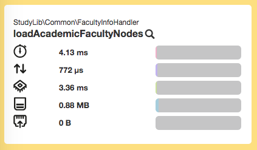
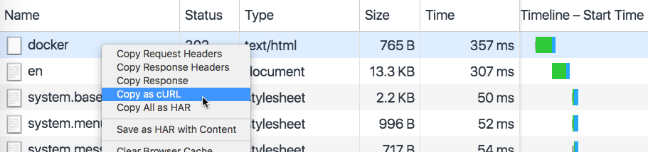
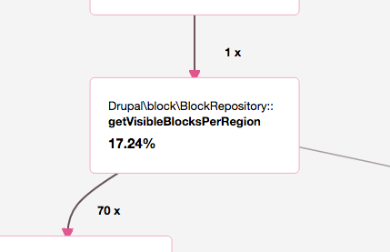

  <h2 style="margin:30px auto 50px 0px; font-size:1.8em; font-weight:bold; width: 90%; text-align: center">
    Using Blackfire.io to profile Drupal loading time
  </h2>
  <table style="width: 90%"><tr>
    <td style="font-size:0.7em; text-align: center; width:50%;">
      
Alex Dergachev

      
 alex@evolvingweb.ca 

      
 @dergachev on twitter, github, drupal.org 

    </td>
    <td style="font-size:0.7em; text-align: center; width:50%;">
      
Dave Vasilevsky

      
 vasi@evolvingweb.ca 

      
 twitter.com/djvasi 

      
 @vasi on github, drupal.org 

    </td>
  </tr></table>

  

--end--

## About Evolving Web

* Drupal development, consulting and training since 2007
* Very involved with the Drupal community
* Specialties
  * Infrastructure
  * Multilingual content
  * Solr search UI
  * Content migration
  * Design and responsive themes
  * Module dev: custom applications built on Drupal
  * Expert Drupal training
* Based in Montreal, clients in Canada and USA

--end--

--end--

## Drupal training program

* Public: Montreal, Ottawa, Toronto, DC Munich, NJ, NYC, Boston, Chiacgo
* Private: Health Canada, Parks Canada, Tourism Quebec, Trent U, McGill U, remote
* Enterprise teams, dev shops, remote

--end--

## About the speakers

* Alex co-founded Evolving Web straight out of undergrad
* Dave was there to show us version control and Linux
* Besides doing Drupal projects since 2008...

--end--

## Outline

* Intro + motivation
* Profiling methodology + philosophy
* Demo 1: Blackfire UI Tour
* Blackfire basics: Terminology, advantages, installation
* Blackfire features (basic + intermediate)
* Demo 2: Copy as cURL
* Blackfire + Drupal tricks
* Demo 3: Block visibility
* Drupal performance considerations
* Q & A

--end--

## Motivation

Why are we all here?

--end--

## Why page loading time is SUPER IMPORTANT

* User experience
* Concurrency + scalability
  * "Throw more hardware at it"
* Financial implications
* Google

--end--

## What profiling doesn't measure

* Front-end / browser rendering time
  * JS
  * CSS / images
* Network issues

--end--

## What profiling measures

* page generation time, CPU + memory info
* blocking operations: SQL + external requests
* what part of your PHP code is slowing things down

--end--

## Why it's important

* Drupal core is not exactly lightweight, contrib varies, custom + legacy code
* We deal with many projects, working on slow ones makes us sad
  * Example scenario of Drupal slowness

--end--

## Profiling gets results, fast

1. McGill Course Calendar
  * 260ms -> 225ms, 13%
  * took 1h to locate and fix a problem involve node\_load
1. D8 evolvingweb.ca site
  * block visibility (80ms out of 450ms, 18%)
  * metatag module patch (saves 30ms)
  * took 2 hours to identify problems, + 2 days to fix
1. Linux Foundation: device certification workflow
  * Views over revisions; used xdebug + code study
  * Took 3 hours to diagnose + add revision cache
  * 980ms -> 420ms
1. Client X
  * slow redirect (390ms -> 95ms), took an hour to diagnose and fix
  * buggy version references\_dialog; 1s to 770ms (23%); 30m to diagnose + fix
  * uncached megamenu: 770ms to 480ms, took 2 hours to diagnose, several hours to fix
  * helped figure out an unfamiliar codebase

--end--

## Profiling Methodology

Let's discuss what we're setting out to do.

--end--

## Define what is "fast enough"

* Identify performance goals: what does it mean to be fast?
* VS other sites
* VS user expectations
* Isolate front-end from back-end
* Understand cached vs uncached behavior
  * why varnish isn't enough

--end--

## How to profile

* Define behavior externally (path, logged in, environment, isolation, caching...)
* Use a profiler to analyze internal behavior
  * Figure out what the code is doing
* Look for any low hanging fruit, bottlenecks
  * (easily cachable requests, bad SQL, blocking requests, unecessary entity loads, watchdog,...)
* Look for signs of overall sluggishness (eg swapping, hard-drive contention, network issues, slow/shared server, lack of APC)
* Build a hypothesis on the bottleneck
* Document the scenario, mark it as a reference (baseline)
* Make a change, do a comparison
  * In drupal, static caching means removing "slow" code just pushes it to later in request
* Iteration
  * Log your runs, later it will be hard to remember all you've changed
* Know when to stop profiling
* Divide and conquer / compare variations
  * variations: pages, site, server env, enable/disable modules, comment out code

--end--

## Measurement tools

* Front-end: Chrome dev tools
  * YSlow, GTMetrix, WebPageTest.org, Google PageSpeed
* Benchmark: ab (Apache bench), jmeter, siege
* Application Performance Monitoring: newrelic
* PHP Profiling: xhprof / blackfire

--end--

## Introducing blackfire PHP profiler

* free for basic use case
* easy to install
* intuitive GUI and process (comparisions, collaboration)
* gets does the job

--end--

## Case study: Coursecal

Site for students at McGill university to browse available courses.

* Tens of thousands of students hit the site at the same time
* Search-driven UI, so caching can't help too much
* Performance becomes is critical!

Let's profile <a class="presenterlink" href="http://docker4:4569/faculties/engineering/undergraduate/ug_eng_dept_of_bioengineering">a page</a> with Blackfire!

  * Visit page
  * Make a profile
  * Tour the profile: READ NUMBERS
    * Metrics (overall, I/O, cpu, memory...)
      * Are these numbers ok for you?
    * Call graph
      * Hot path
      * Is this a reasonable amount of time for this function?
    * Function list
      * Calls, excl, incl
      * Expand: metrics (hover)
      * Expand: callees (time restricted to call)
      * Search
  * Let's find a problem function
    * Hot path: theme()
    * moriarty_preprocess_page is long for a preprocess hook!
    * Follow down graph until the time changes significantly
    * We get to loadAcademicFacultyNodes
    * Calling node_load 36 times! Could be multiple

--end--

<h2 class="mini">The slow code</h2>

    NOFADE:public function loadAcademicFacultyNodes($language = '', $key = 'name'){
      $return = array();
      HIGHLIGHT:foreach($this->faculties as $f){
        if ($f->nid && $f->code){
          if (!$language || $f->language === $language){
            HIGHLIGHT:$node = node_load($f->nid);
            if ($key && $f->$key){
              $return[$f->$key] = $node;
            } else {
              $return[] = $node;
            }
          }
        }
      }
      return $return;
    }

Iterate over faculties, load nodes one at a time.

  * Loading nodes one at a time is slow! Should load them all together, to
    minimize the number of DB queries.
  * This code was written for D6, where node\_load\_multiple didn't exist
  * Now that it's in D7, let's fix it.

--end--

<h2 class="mini">A fix</h2>

    NOFADE:public function loadAcademicFacultyNodes($language = '', $key = 'name'){
      $nids = array();
      HIGHLIGHT:foreach($this->faculties as $f){
        if ($f->nid && $f->code){
          if (!$language || $f->language === $language){
            if ($key && $f->$key){
              HIGHLIGHT:$nids[$f->$key] = $f->nid;
            } else {
              $nids[] = $f->nid;
            }
          }
        }
      }

      HIGHLIGHT:$nodes = node_load_multiple($nids);
      $return = array();
      foreach ($nids as $k => $v) {
        $return[$k] = $nodes[$v];
      }
      return $return;
    }

Collect the nids, load all nodes at once.

  * Grab all the node IDs
  * Load the nodes all at once
  * Return data in the expected structure

--end--

## Case study: Coursecal

Saved about 25ms!

A real improvement in under an hour of total work, from profiling to committing a fix.

--end--

## Understanding Blackfire.io

About how it works...

--end--

## Understanding Blackfire.io

* By Sensio Labs, creators of Symphony
* Started as a fork of xhprof...
  * SAAS, easier to manage (but perhaps data risk)
  * Interactive callgraph, better user experience
  * Better UX Supports comparisons
  * Actively maintained, support for PHP 7
  * Great docs, simpler installation
    * packages (docker / chef / ansible), embedded (magento cloud, heroku, platform.sh)

--end--

## Installing Blackfire

Components:

* probe, a minimalistic PHP extension
* blackfire-agent, a daemon that connects probe to blackfire servers
* Companion, a Chrome extension
* blackfire command-line client

--end--

## Installing Blackfire

View [Blackfire Install Docs](https://blackfire.io/docs/24-days/06-installation), which has your API keys, and also instructions for RedHat, OSX, Windows, docker, chef, and more. Install steps on ubuntu:

          wget -O - https://packagecloud.io/gpg.key | sudo apt-key add -
          echo "deb http://packages.blackfire.io/debian any main" | sudo tee /etc/apt/sources.list.d/blackfire.list
          sudo apt-get update
          sudo apt-get install blackfire-agent blackfire-php
          # fill in server-id and server-token
          sudo blackfire-agent --register
          sudo /etc/init.d/blackfire-agent start

          # for command-line use, fill in client-id and client-token
          blackfire config

          # disable xhprof and xdebug php extensions
          # restart apache or php-fpm
--end--

## Blackfire features

* Comparison with baseline profile
* Copy as curl (for ajax, cookies, POST requests)
* profiling command-line / drush commands
  * drush.launcher
* Sharing profiles publicly
* Use blackfire to learn new codebase (or contrib modules)

--end--

## Case study: Client X

Complex site that we're not allowed to show you!

  * Unfamiliar code base
  * Originally built by people unfamiliar with Drupal

--end--

## The problem

#### Homepage is slow

Let's check it out in Chrome inspector's _Network_ tab:

That's a pretty slow redirect!

--end--

## Profiling

Our browser is at the path _/en_, so that's what Blackfire would profile

But we want to profile the redirect itself!

--end--

## Profiling

Give the results of _Copy as cURL_ to Blackfire:

--end--

## Profiling

Give the results of _Copy as cURL_ to Blackfire:

--end--

## Profiling

Blackfire does its magic:

--end--

## Profiling

Well, that's unexpected:

Why are we rendering a redirect‽‽‽

--end--

## Analysis

Let's see what's triggering the redirect:

--end--

## Analysis

Let's see what's triggering the redirect:

--end--

## Analysis

Whoa, it's a preprocess hook!

--end--

## 😱

    function tq_home_preprocess_page(&$variables) {
      $tq_init = array_key_exists('tq_lang_init', $_COOKIE) ? $_COOKIE['tq_lang_init'] : null;
      if ($tq_init === null) {
        setrawcookie('tq_lang_init', 1, REQUEST_TIME + 60*60*24*7, '/');
        $languages = language_list();
        $browser_lang = locale_language_from_browser($languages);
        if ($browser_lang !== $GLOBALS['language']->language && drupal_is_front_page()) {
          drupal_goto('<front>', array(
            'language' => $languages[$browser_lang],
          ));
        }
      }
    }

Don't do this!

  What this code tries to do:
    * Homepage is in French only
    * The first time a user visits, redirect to their language's translation
    * Set a cookie to remember that they've been detected, so they can go to
      homepage to get French again.

  This code is what we call a "worst practice". Performance: It redirects the user AFTER rendering much of page, super slow.

  But also:
  * If user is detected as English, but then chooses French… one week later, redirected to English again!
  * If you have cookies blocked/disabled, you just redirect forever!

--end--

## A fix?

    function tq_home_init() {
      if (drupal_is_cli()) {
        return;
      }

      $tq_init = array_key_exists('tq_lang_init', $_COOKIE) ? $_COOKIE['tq_lang_init'] : null;
      if ($tq_init === null) {
        // ... continue as above

Still not great, most of the problems from before remain.

--end--

## A fix?

But at least performance is better:

--end--

## Case study: Client X

We improved performance, that's nice.

Also:

* We know more about the crazy things the site is doing
* Better understanding of future performance problems
  * Eg: Cookies and varnish
* We learned how to use _Copy as cURL_ with Blackfire!

--end--

## Advanced Blackfire features

* Aggregation (10 requests, averaged)
  * Turn aggregation to control for caching and side effects
* Blackfire doesn't keep arguments (or 1 at most)
* Sampling, not tracing!
* Blackfire PHP SDK

--end--

## Other considerations

* xdebug conflict
* profiling overhead (PHP 7)
* Tradeoff: memory vs time
* Caching and dirty runs
  * D7 + D8 cache killing

--end--

## Diagnostic tricks

* References / comparison
* xdebug + read the code
* Argument capturing
* SDK: enableProbe / disableProbe

--end--

<h2 class="small">Case study: evolvingweb.ca</h2>

We've already upgraded our site to Drupal 8! We learned a lot, and told people all about it:  [http://tiny.cc/midcamp-d8-upgrade](http://tiny.cc/midcamp-d8-upgrade)

D8 is great, we love features like Views in core, CKEditor, Twig…

But it's slower than D7 😟

--end--

<h2 style="border: none;">Blog posts</h2>

Really fast when cached!

No so fast after any node is edited, definitely slower than D7.

--end--

## Uncached requests

If we edit a node and then profile, Blackfire will have one uncached requests, then nine cached ones.

We could disable aggregation, but then our measurements will fluctuate too much.

--end--

## Uncached requests

Disable page cache: `drush pmu -y page_cache`

But we still have the dynamic page cache and render cache!

  Don't want to disable render cache, because even after we edit one node, many rendered elements will still have valid caches.

Instead of turning off more caching layers, let's reproduce the situation we care about.

--end--

## Uncached requests

At the start of each request, invalidate cache:

    class EwsiteSubscriber implements EventSubscriberInterface {
      public static function getSubscribedEvents() {
        $events[KernelEvents::REQUEST][] = ['killBlogCache'];
        return $events;
      }

      public function killBlogCache(GetResponseEvent $event) {
        $tags = ['node_list', 'node:239'];
        \Drupal::service("cache_tags.invalidator")->invalidateTags($tags);
      }
    }

Registered our Event Subscriber in `ewsite.services.yml`.

Don't commit this! For profiling only

--end--

## Profiling

Now let's see why it's so slow:

That's part of D8 core, and it's taking 117 ms!

--end--

## Analysis

Why so long to figure out what blocks should be visible?

  * We do have a lot of blocks
  * But that's normal for a D8 site, so many things are blocks now! Page titles, menus, footers, views...

--end--

## Analysis

    public function getVisibleBlocksPerRegion(array &$cacheable_metadata = []) {
      // ...
      foreach ($this->blockStorage->loadByProperties(array('theme' => $active_theme->getName())) as $block_id => $block) {
        $access = $block->access('view', NULL, TRUE);
        // ....
      }
    }

To get a list of blocks, Drupal 8:

* Loads every single block in the current theme just to check access
* Does access check using visibility conditions—pretty complex!

  * Iterates through lazy collections many times
  * Merges metadata many times over

--end--

## This sounds familiar…

When Drupal wants to show one node, it loads the node and checks `$node->access()`.

When Drupal wants a _list_ of nodes, that would be too slow! Instead, we use the node\_access system:

* Modules assign a set of _node access records_ to each node when it's saved, which are stored in the database
* Modules provide the current request with a set of _node grants_
* To see if a node should be visible, the current grants are compared with the access records
* A single database query does the comparison for all nodes at once!

--end--

## This sounds familiar…

Let's implement the same thing for blocks!

* Plugins will provide _block access records_ to each block when it's saved, to be stored in the database
* Plugins will provide the current request with a set of _block context values_
* To see if a block should be visible, the current context values will be compared with the access records
* A single database query will do the comparison for all blocks

--end--

## This sounds familiar…

I've implemented this in a module I've called _block\_access\_records_, which is available here: 
[github.com/vasi/block\_access\_records](http://github.com/vasi/block_access_records)

* It already has plugins for all of Drupal's built-in block visibility conditions, so on most sites it will just work
* Since D8 uses dependency injection, we can just replace the default _BlockRepository_ implementation with our new version
* Sites with custom conditions or other unusual configuration should be wary about trying this

--end--

<h2 class="small">Case study: evolvingweb.ca</h2>

TODO: image of comparison profile

We saved over 80 ms on every uncached request!

--end--

## Premium Blackfire features

* Environments
  * Groups of profiles and team members
  * One for dev / stage / prod, per project
* Longer data retention
* CI + scenarios + notifications
  * trigger via web service
  * slack integration
* Assertions
* Custom metrics
* Recommendations
* Self-hosted version
* Talk to the guys in the Blackfire booth!

--end--

## Generic Drupal Backend Tips

* Use these: varnish/memcache/APCu/Opcache
  * But memcache only helps speed up cache\_set/ cache\_get and overall load on DB
* D8 render cache with tags + context
* D7 vs D8 (complexity Vs caching)
* Control number of contrib modules
  * Do less stuff, or write it custom
* Mysql tuning http://www.jeffgeerling.com/articles/web-design/2010/drupal-performance-white-paper
* Cron job, search, watchdog, SSD, multiple app heads, CDN, php7, fpm, nginx for files
* cookies + page cache
* devel web profiler
* entity\_load\_multiple()
 * devel module's sql query log

--end--

## Following Up

* Please fill in the [feedback form](https://events.drupal.org/neworleans2016/sessions/using-blackfireio-profile-your-loading-time) for this session!
* Join us for Code Sprints
  * Friday, May 13 at the Convention Center
  * First-Time Sprinter Workshop - 9am-12pm in Room 271-273
  * Mentored Core Sprint - 9am-6pm in Room 275-277
  * General Sprints - 9am-6pm in Room 278-282
* Evolving Web: [evolvingweb.ca](http://evolvingweb.ca)
* Follow @dergachev and @djvasi on twitter
  * write us for help
* block\_access\_records: [github.com/vasi/block\_access\_records](https://github.com/vasi/block_access_records)
* Go to Blackfire booth
  * Blackfire.io coupon - DRUPALNOLA2016
  * Pick up "24 days of Blackfire", a great short book to read on the plane ride back!
