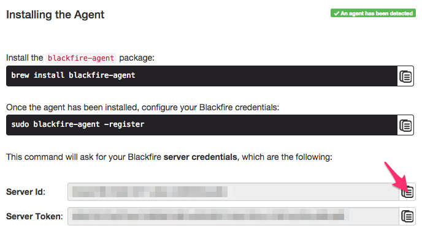
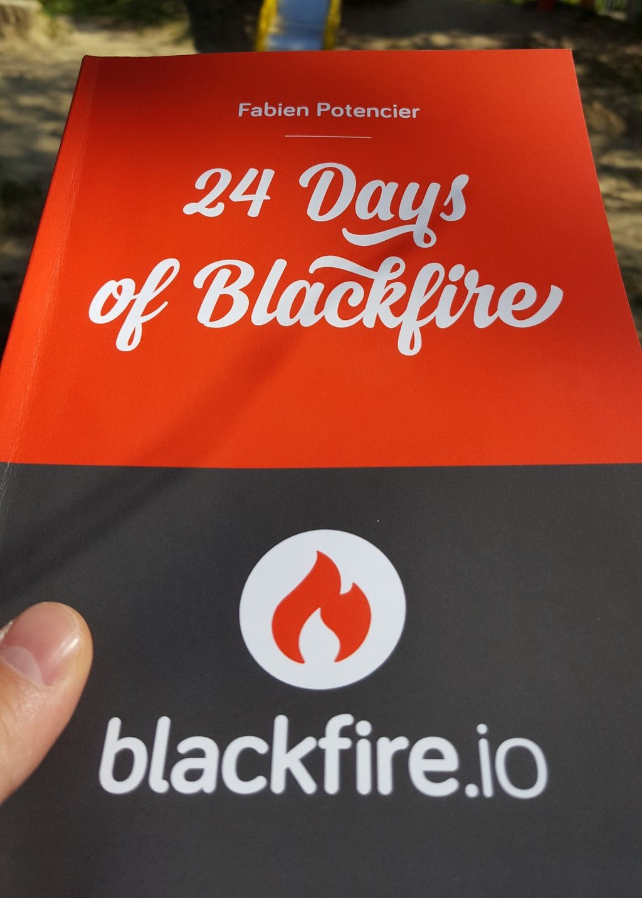

  <h2 style="margin:30px auto 50px 0px; font-size:1.8em; font-weight:bold; width: 90%; text-align: center">
    Using Blackfire.io to profile Drupal loading time
  </h2>
  <table style="width: 90%"><tr>
    <td style="font-size:0.7em; text-align: center; width:50%;">
      
Alex Dergachev

      
 alex@evolvingweb.ca 

      
 @dergachev on twitter, github, drupal.org 

    </td>
    <td style="font-size:0.7em; text-align: center; width:50%;">
      
Dave Vasilevsky

      
 vasi@evolvingweb.ca 

      
 twitter.com/djvasi 

      
 @vasi on github, drupal.org 

    </td>
  </tr></table>

  

--end--

## About the speakers

--end--

* Drupal development, consulting and training since 2007
* Based in Montreal, clients in Canada and USA
* Very involved with the Drupal community
* Specialties
  * Content migration
  * Design and responsive themes
  * Module dev: custom applications built on Drupal
  * Infrastructure, Multilingual content, Solr search UI
* Extensive Drupal training program

--end--

--end--

## Outline

* Profiling methodology + philosophy
* Blackfire demo and discussion
* Case studies from our projects

* Intro + motivation
* Profiling methodology + philosophy
* Demo 1: Blackfire UI Tour
* Blackfire basics: Terminology, advantages, installation
* Blackfire features (basic + intermediate)
* Demo 2: Copy as cURL
* Blackfire + Drupal tricks
* Demo 3: Block visibility
* Drupal performance considerations
* Q & A

--end--

# Motivation

--end--

## Why page loading time is SUPER IMPORTANT

* User experience
* Concurrency + scalability
  * "Throw more hardware at it"
* Financial implications
* Google's history

--end--

## What profiling doesn't measure

* Browser rendering time (HTML, CSS)
* Network issues
* JavaScript run-time
* Asset fetching (imgs, fonts)

--end--

--end--

## What profiling measures

* Time spent
* Resource usage: CPU, memory, DB, network, I/O
* Hooks into PHP engine, instruments each function call

--end--

## Why it matters for Drupal

* Real Drupal sites can be heavy
  * Core is usually well-optimized, but not always
  * Contrib varies in quality, custom + legacy code more so
* Varnish isn't enough
* Working on slow sites makes us sad

--end--

## Profiling gets results, fast

<table>
  <tr><th>Project</th><th>Improvement</th><th>Time spent</th></tr>
  <tr><td>McGill academic calendar</td><td>13%</td><td>1 hour</td></tr>
  <tr><td>Client X</td><td>52%</td><td>6 hours</td></tr>
  <tr><td>Evolving Web D8</td><td>21%</td><td>2 days</td></tr>
  <tr><td>AllJoyn Certification</td><td>57%</td><td>3 hours</td></tr>
</table>

--end--

# How to profile: M.A.F.I.A.

--end--

<h2 class="small">How to profile: Measure</h2>

* Figure out exactly what you care about (request, cookies)
* Variations, eg: pages, server env, disable modules…
* Use a profiler to analyze code

--end--

## How to profile: Analyze

* Look for low hanging fruit, bottlenecks
  * cachable calculations, bad SQL, blocking requests, unnecessary loads…
* Look for signs of overall sluggishness
  * eg: swapping, Vagrant shared folders, server contention, missing opcache

--end--

## How to profile: Fix

* Make a change
* Compare to baseline
  * In Drupal, static caching means removing "slow" code just pushes it to later in request

--end--

## How to profile: Iterate

* Measure again
* Know when to stop profiling
  * Decide what's "fast enough"
* Log your runs, later it will be hard to remember all you've changed

--end--

## How to profile: Applause

* I couldn't come up with a better "A"

--end--

## Measurement tools

* Front-end: Chrome Developer Tools
* Benchmark: ApacheBench, JMeter
* Application Performance Monitoring: New Relic
* PHP Profiling: xhprof, Blackfire

--end--

## Blackfire.io

* By SensioLabs, creators of Symfony and Twig
* Freemium, SaaS
* Great docs
* Started as a fork of xhprof
  * Simpler installation
  * Interactive callgraph, better UX
  * Supports comparisons
  * Actively maintained, support for PHP 7
  * No overhead, you can leave it on all the time

--end--

## Case study: McGill U

McGill University listing of courses and programs.

--end--

## Case study: McGill U

Let's <a class="presenterlink" href="https://blackfire.io/profiles/131f6f0c-0a90-4ac8-8d7e-7d3e773377ec/graph">profile</a> <a class="presenterlink" href="http://docker4:4569/faculties/engineering/undergraduate/ug_eng_dept_of_bioengineering">a page</a> with Blackfire!

  * Visit page
  * Make a profile
  * Tour the profile: read numbers?
    * Metrics (overall, I/O, cpu, memory...)
    * Call graph
      * Hot path -> resources
    * Function list
      * Number of calls
      * Expand: callees (time restricted to call)

  * Let's find a problem function
    * Hot path: theme()
    * moriarty_preprocess_page is long for a preprocess hook!
    * Follow down graph until the time changes significantly
    * We get to loadAcademicFacultyNodes
    * Calling node_load 36 times! Could be multiple

--end--

<h2 class="mini">The slow code</h2>

    NOFADE:public function loadAcademicFacultyNodes($language, $key){
      HIGHLIGHT:foreach($this->faculties as $f){
        if ($f->nid && $f->code){
          if (!$language || $f->language === $language){
            HIGHLIGHT:$node = node_load($f->nid);
            if ($key && $f->$key){
              $return[$f->$key] = $node;
            } else {
              $return[] = $node;
            }
          }
        }
      }
      // ...
    }

Iterate over faculties, load nodes one at a time.

  * Loading nodes one at a time is slow! Should load them all together, to
    minimize the number of DB queries.

--end--

<h2 class="mini">A fix</h2>

    NOFADE:public function loadAcademicFacultyNodes($language, $key){
      HIGHLIGHT:foreach($this->faculties as $f){
        if ($f->nid && $f->code){
          if (!$language || $f->language === $language){
            if ($key && $f->$key){
              HIGHLIGHT:$nids[$f->$key] = $f->nid;
            } else {
              $nids[] = $f->nid;
            }
          }
        }
      }

      HIGHLIGHT:$nodes = node_load_multiple($nids);
      // ...
    }

Collect the nids, load all nodes at once.

--end--

## Case study: McGill U

Saved about 25ms!

A real improvement in under an hour of total work, from profiling to committing a fix.

--end--

## Installing Blackfire

Sign in with GitHub, then view the super-easy [Blackfire Install Docs](https://blackfire.io/docs/24-days/06-installation).

This installs:

* `Probe`, a minimalistic PHP extension
* `Agent`, a daemon that connects probe to blackfire servers
* `Companion`, a Chrome extension
* `Client`, command-line client

It has has your API keys, and also instructions for Red Hat, OS X, Windows, docker, chef, and more. Install steps on Ubuntu:

          wget -O - https://packagecloud.io/gpg.key | sudo apt-key add -
          echo "deb http://packages.blackfire.io/debian any main" | sudo tee /etc/apt/sources.list.d/blackfire.list
          sudo apt-get update
          sudo apt-get install blackfire-agent blackfire-php
          # fill in server-id and server-token
          sudo blackfire-agent --register
          sudo /etc/init.d/blackfire-agent start

          # for command-line use, fill in client-id and client-token
          blackfire config

          # disable xhprof and xdebug php extensions
          # restart apache or php-fpm

--end--

## Blackfire features

* Comparison with baseline profile
* Command line profile trigger (for AJAX, cookies, POST requests, web services)
* Profiling command-line / drush commands
  * `blackfire run drush.launcher cc all`
* Sharing profiles publicly

--end--

## Case study: Client X

--end--

## The problem

#### Homepage is slow

Let's check it out in Chrome inspector's _Network_ tab:

  That's a pretty slow redirect!

  Our browser is at the path `/en`, so that's what Blackfire would profile
  But we want to profile the redirect itself!

--end--

## Profiling

Use Chrome's _Copy as cURL_:

--end--

## Profiling

Give the results of _Copy as cURL_ to Blackfire:

--end--

## Profiling

Blackfire does its magic:

--end--

## Analysis

    function tq_home_preprocess_page(&$variables) {
      // ...
      $lang = locale_language_from_browser($languages);
      drupal_goto('<front>', $lang);
    }

Moved it to a hook\_init!

--end--

## Case study: Client X

* Much better performance!
* We learned a lot about an unfamiliar codebase
* After a few more hours, implemented other dramatic improvements

  Took just an hour or two.

--end--

# Blackfire tips

--end--

## Blackfire tips

* Aggregation (10 requests, averaged)
  * Disable aggregation to control for caching and side effects
* Blackfire doesn't keep function arguments

--end--

## Blackfire tips

* xdebug
  * Turn off for profiling
  * Turn on for analysis
* profiling overhead
* Tradeoff: memory vs time
* SDK: enableProbe / disableProbe

  Can't use blackfire to compare different PHP versions

--end--

## Case study: evolvingweb.ca

--end--

<h2 class="small">Case study: evolvingweb.ca</h2>

We already upgraded our site to Drupal 8!

D8 is great, we love features like Views in core, CKEditor, Twig…

  
But it's slower than D7

  

  We learned a lot about D8, told people all about it.

--end--

<h2 style="border: none;">Blog view</h2>

Really fast when cached!

No so fast after any node is edited, and D8 invalidates cache tags

--end--

## Uncached requests

Aggregation makes it hard to profile uncached behavior.

So at the start of each request, pretend a node was edited:

    class EwsiteSubscriber implements EventSubscriberInterface {
      public static function getSubscribedEvents() {
        $events[KernelEvents::REQUEST][] = ['killBlogCache'];
        return $events;
      }

      public function killBlogCache(GetResponseEvent $event) {
        $tags = ['node_list', 'node:239'];
        \Drupal::service("cache_tags.invalidator")->invalidateTags($tags);
      }
    }

  If we edit a node and then profile, Blackfire will have one uncached requests, then nine cached ones.

  We still want reliable numbers.

--end--

## Profiling

Now let's see why it's so slow:

That's part of D8 core, and it's taking 117 ms!

  * We do have a lot of blocks
  * But that's normal for a D8 site, so many things are blocks now

--end--

## Analysis

    public function getVisibleBlocksPerRegion(array &$cacheable_metadata = []) {
      // ...
      foreach ($this->blockStorage->loadByProperties(array('theme' => $active_theme->getName())) as $block_id => $block) {
        $access = $block->access('view', NULL, TRUE);
        // ....
      }
    }

To get a list of blocks, Drupal 8:

* Loads every single block in the current theme just to check access
* Checks access using visibility conditions—pretty complex!

  * Iterates through lazy collections many times
  * Merges metadata many times over

--end--

## Does this sound familiar?

### node\_access!

  Instead of loading and checking each node, uses a single DB query.

--end--

## A fix

Built a module that determines block visibility in one DB query:
[github.com/vasi/block\_access\_records](http://github.com/vasi/block_access_records)

We saved over 80 ms on every uncached request!

* Similar to how `node_access` works, read more about it on our blog.
* Supports Drupal's built-in block visibility conditions

  Caveats:
    * Sites with custom block conditions may need to implement them
    * Not super well tested

--end--

## Blackfire Premium

* Environments (team)
* Data retention
* Assertions + Scenarios + CI + notifications
* Custom metrics
* Recommendations
* On-Premise version
* Talk to the guys in the Blackfire booth!

--end--

## Calls to Action!

* Please fill in the [feedback form](https://events.drupal.org/neworleans2016/sessions/using-blackfireio-profile-your-loading-time) for this session!
* Join us for Code Sprints
  * Friday, May 13 at the Convention Center
  * First-Time Sprinter Workshop - 9am-12pm in Room 271-273
  * Mentored Core Sprint - 9am-6pm in Room 275-277
  * General Sprints - 9am-6pm in Room 278-282

--end--

## Calls to Action!

* Follow <a href="https://twitter.com/dergachev">@dergachev</a> and <a href="https://twitter.com/djvasi">@djvasi</a> on twitter!
* Go to the Blackfire booth
* Other resources:
  * block\_access\_records: [github.com/vasi/block\_access\_records](https://github.com/vasi/block_access_records)
  * Another Blackfire case study: [evolvingweb.ca/blog/improving-drupal-speed-blackfire-io-part-1](https://evolvingweb.ca/blog/improving-drupal-speed-blackfire-io-part-1)
  * Block visibility case study: [evolvingweb.ca/blog/speed-up-drupal-8-block-rendering-blackfire-io](https://evolvingweb.ca/blog/speed-up-drupal-8-block-rendering-blackfire-io)
  * Our talk about our D8 upgrade [2016.midcamp.org/session/moving-our-company-site-drupal-8-break-ice](http://2016.midcamp.org/session/moving-our-company-site-drupal-8-break-ice)

--end--

## Drupal training program

* Public: Montreal, Ottawa, Toronto, DC Munich, NJ, NYC, Boston, Chiacgo
* Private: Health Canada, Parks Canada, Tourism Quebec, Trent U, McGill U, remote
* Enterprise teams, dev shops, remote

--end--

## Visit us in Canada!

--end--

## Just one more thing…

