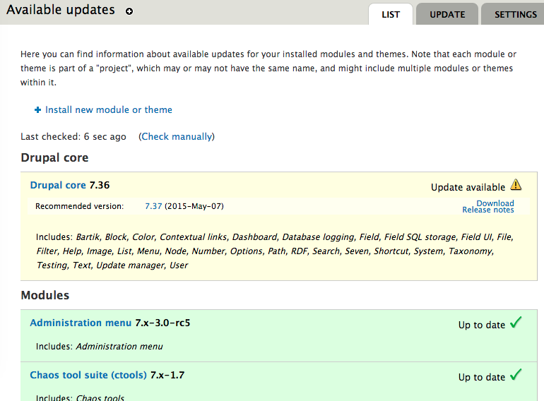

<div style="position: absolute; height: 97%; width: 100%;">
  <h2 style="margin:30px auto 50px 0px; font-size:1.8em; font-weight:bold; width: 90%; text-align: center">
    Test Driven Drupal Upgrades
  </h2>
  <table style="width: 90%"><tr>
    <td style="font-size:0.7em; text-align: center; width:50%;">
      <div style="font-size:1.2em; font-weight:bold;">Alex Dergachev</div>
      <div> alex@evolvingweb.ca </div>
      <div> github.com/dergachev </div>
      <div> twitter.com/dergachev </div>
      <div> drupal.org/u/evolvingweb </div>
    </td>
    <td style="font-size:0.7em; text-align: center; width:50%;">
      <div style="font-size:1.2em; font-weight:bold;">Dave Vasilevsky</div>
      <div> vasi@evolvingweb.ca </div>
      <div> github.com/vasi </div>
      <div> twitter.com/djvasi </div>
      <div> drupal.org/u/vasi </div>
    </td>
  </tr></table>

  <p></p>
</div>

--end--

## Outline

* __About us__ (3m)
* __Intro__ (9m)
  * Testing, Minor Updates, Major Core Upgrades
* __Case study__: McGill Courses and Programs D7 (15m)
  * Project description, Challenges, Solutions
  * Tools: Docker, PHPUnit, SiteDiff
* __Other tools__: behat, CircleCI	(4m)
* __drupal-docker-marriage demo__ (8m)
* __More tools__: git, backups, upgrade path tests (4m)
* __SiteDiff demo__ (8m)

--end--

## About Evolving Web

* Drupal development, consulting and training since 2007
* Very involved with the Drupal community
* Specialties
  * Large, scalable infrastructure and deployments
  * Multilingual content management
  * Apache Solr search interfaces
  * Content import and synchronization
  * Custom theme development
  * Custom module development
  * Search engine optimization for Drupal (SEO)
  * Integration with legacy systems
  * Expert Drupal training
* Based in Montreal, clients in Canada and USA

--end--


--end--

## Drupal training program


* Public: Montreal, Ottawa, Toronto, DC Munich, NJ, NYC, Boston
* Private: Health Canada, Parks Canada, Tourism Quebec, Trent U, McGill U
* Enterprise teams, dev shops, remote

--end--

## About the speakers

* Alex co-founded Evolving Web straight out of undergrad
* Dave was there to show us version control and Linux
* Besides doing Drupal projects since 2008...

--end--

## Introduction

* Upgrades are important for security
  * Security bugs are constantly found in Drupal and Drupal modules
  * Eg: Drupalgeddon (SA-CORE-2014-005) fixed in 7.32
* Upgrades bring new features
  * Drupal 7 has many performance improving features over D6
  * Webform 4 brings token support
* After Drupal 8 is released, Drupal 6 will become unsupported!

--end--

## Introduction

* Many Drupal developers aren't great at upgrading. Why?
  * Not everyone knows how
  * It can take time
  * We're afraid of regressions
  * We hate manual testing

--end--

## How to change

* Learn how to do upgrades
* Good tools make it easier and faster
* Testing makes it safe

--end--

## Minor updates vs. major upgrades

* Minor updates: 7.35 -> 7.36
  * Modules need updates too!
  * Perform these as often as possible, to keep up with security
* Major upgrades: 6.28 -> 7.36
  * Brings many, many new features and opportunities
  * Necessary before D6 is obsolute

--end--

## Minor update basics

* When to update: Use the Drupal Security Advisories mailing list: https://www.drupal.org/security
  * Or use the update module
* Where to update: In staging
  * Never do an update for the first time in production, you don't know if anything will break
* Watch out for hacks or patches to your modules!
  * Use the ```hacked``` module to find them



--end--

## Minor update basics

* How to update in place:
  * ```drush pm-updatestatus``` to list available updates
  * ```drush pm-update``` to perform updates
* For real sites in production:
  * Run update on dev/staging
  * Test that everything is working
  * Check your code changes into version control
  * On prod, pull changes and ```drush updb```
* Update hooks
  * Keep database in sync with versions of code
  * Eg: new column in database; rename variable
  * Running them: ```update.php``` or ```drush updb```

--end--

## Major upgrade basics

There are is no such thing as a basic major upgrade.

--end--

## Major upgrade basics

* Major upgrades can be harder than a site rebuild
  * APIs can change in ways that aren't backwards-compatible
  * Modules may not be updated yet, or at all
* We are talking about D6 to D7
  * Not clear whether it's possible to upgrade D7 to D8
  * D8 might require use of migrate module instead of update hooks

--end--

## Major upgrade basics

Before you can start the upgrade (still in D6):

* Update core and ALL contrib modules to latest d6 version
* Defeaturize
* Cleanup and fix bugs
* Disable all contrib and optional modules
* If modules have bad upgrade path, may need to uninstall
* Switch to core theme (garland)

--end--

## Major upgrade basics

Perform the upgrade:

* Update code of core and remaining modules to highest D7 version
* Run `drush updb`
* Use content_migrate for CCK->fields upgrade path
* Reenable and test contrib modules
  * Iterate on upgrading code and testing
  * Often need to find alternatives (popups -> references_dialog)
* Reenable and test custom modules
  * Start with coder upgrade
* Restore project-specific theme
* Adjust site as necessary to rebuild missing functionality
  * Lots of misc testing, development, database tweaks

--end--

## Testing basics

* Unit testing
  * D7: SimpleTest (DrupalUnitTestCase)
  * D8: PHPUnit
  * Fast, good for standalone functions
  * Use fixtures for testing
  * Can't test integration
* Not too useful for upgrades
  * Contrib modules are already tested
  * What's likely to break: integration
* Useful for your custom modules during major upgrades

--end--

## Testing basics

* Integration testing
  * SimpleTest (DrupalWebTestCase)
  * Powerful Drupal integration: Enable modules, create content, add users...
  * By default, tests your module in isolation
  * Much slower, needs to site-install for each test
  * Can't test things like JavaScript, CSS
  * Tight coupling, hard to maintain

--end--

## Testing basics

* UI testing
  * Eg: Selenium, CasperJS, behat
  * Tests your site by controlling a real browser
  * Pretty slow, and very tight coupling
  * Usually no Drupal integration
  * Very powerful and thorough
  * Great replacement for manual testing

--end--

## D7 upgrade case study

* Project description
* Challenges
* Solutions
* Tools
  * Docker for build automation
  * PHPUnit and SiteDiff for testing

--end--

## D7 upgrade case study


* McGill University's Course Calendar
* "Academic Catalog": Programs, Courses, and University Regulations
* Legal documents, course schedules, metadata, cross-referencing
* Search-driven UI
* Buckets of imported records

--end--

## Search-driven UI


* Custom seach tabs containing nested facets
* Section specific search pages in menus
* apachesolr-6.x-2.x -> Search API

--end--

## Logically nested menus


* All pages live in a single logical menu hierarchy, ~10k items
* ~100s menu items in primary\_links, rest in various book menus
* UI consistency: menus, breadcrumbs, URLs
* Merged via custom code, using core menu\_tree\_page_data, menu\_block
* To upgrade this code, we refactored extensively and wrote PHPUnit tests with fixtures

--end--

## Many records, complex structure

* 70k node revisions per year; mostly imported from banner+documentum
* 15 content types, 170 field instances; cross-linked via node reference fields
* Incomplete i18n implementation
* Custom input filters (auto-detection of course names in any HTML content)

--end--

## Hard to upgrade

* Lots of custom modules
  * Legacy, with 4 years of cruft, lots of coupling
* Legal requirement that data shown must be correct and complete
* Deliverable = upgrade script, not code + db dump
  * Must be able to re-run on prod database
  * Must also be adaptable for 4 previous years (separate DBs)
* Limited time and resources: 2 devs, 12 weeks

--end--

## Easier parts

* Around 20-30 contrib modules
* No auth users except admins
* Little dynamic content except via import scripts
* Evolving Web wrote the original code
* Disciplined client, no scope creep

--end--

## Harder parts

* Features have no upgrade path
* Client unable to provide complete dev environment
  * We had to deduce which contrib modules enabled, version
  * Missing some custom modules defining content types, modules, blocks
* Performance: 2 days to run content migrate
* i18n bug related to field allowed\_values translation
* Misc upgrade path bugs (entityreference, nodeblock)

--end--

## Technical solutions

* Test-driven refactoring first for sanity
* Build automation
* Content migrate tweaks for speed
* SiteDiff for correctness
* Docker for build process automation

--end--

## Refactoring and unit testing

* PHPUnit tests for custom modules
* Feasible to make it work with D7 (autoloading vs manual)
* Use fixtures in your test (eg. for menu trees and nodes)
* Sometimes had to bootstrap drupal (eg. for input filters)
* Can't mock/swap drupal functions, need process isolation
* Refactor custom code to allow dependency injection of mocks

--end--


## Build process

* D6 deploy script
* D6 refactor adjustments
* D6 prepare (defeaturize, turn off non-core modules, change theme to bartik, pm-uninstall several modules)
* drush updb
* Enable modules, run contrib updb
* content migrate
* [menu\_adjustments.php](https://github.com/evolvingweb/coursecal-d7/blob/d7/build/upgrade/menu_adjustments.php)
* [d7\_adjustments.sh](https://github.com/evolvingweb/coursecal-d7/blob/d7/build/scripts/d7_adjustments.sh)
* [d7\_adjustments\_solr.sh](https://github.com/evolvingweb/coursecal-d7/blob/d7/build/scripts/d7_adjustments_solr.sh)

--end--

## Performance tweaks

* content\_migrate (submodule of CCK) is slow (~2 days)
  * One field record (delta) at a time, one node at a time, one value at a time
  * Prune the database (10% of the nodes, focused on 1 faculty, try to keep consistency)
  * [https://github.com/dergachev/content\_migrate\_tweaks](/https://github.com/dergachev/content_migrate_tweaks/)
  * Replaced with INSERT ... SELECT ... queries as >100x optimization
  * Validated with unit tests, table checksums, SiteDiff
* `drush php-script` vs `hook_update_N`

--end--

## Build automation

Requirements:

* Easily deployed dev environments
* Consistency between dev and prod
* Checkpoints for testing
* Caching
* Simplicity (bash)

--end--

## Docker

* Docker gives a dev friendly UI to automate building and running virtualized containers
* Allows consistent dev, testing, and prod environments
  * Easier to onboard developers, replicate bugs, works great with CI
* Dockerfile build process:
  * Bash-like
  * Starts with clean Ubuntu image
  * Installs all necessary packages: tomcat, solr, memcache, nginx, xhprof, xdebug, ...
  * Runs our deploy scripts
  * Caching
  * Caveats (Makefiles, Linux, TIMTOWTDI)

--end--

## SiteDiff

* [github.com/dergachev/sitediff](https://github.com/dergachev/sitediff)
* show pretty diffs of HTML contents of whole sites
* sanitization - easy to write! easy to maintain!
* History: buyandsell
* Compares sites HTML, one page at a time
* Spurious diffs: needs sanitization rules
** Several types
** Some are common for Drupal, eg: form build IDs
* Demo with 7.36 bug?
* Limitations
** JavaScript
** Dynamic content
** Admin UI
* Case study: AllSeen DevDocs
** Drupal vs non-Drupal, migration
** Easy to generate the sitemap automatically
** Needed heavy sanitization
** Caught useful bugs: HTML entity issues, bad quoting
** Good on updates to migration source, we could verify that changes to site matched changes to source

--end--

## SiteDiff Input

        paths:
         - /
         - /user

        selector: 'body'

        sanitization:
        - title: 'remove form build id'
          pattern:    '<input type="hidden" name="form_build_id" value="form-[a-zA-Z0-9_-]+" *\/?>'
          substitute: '<input type="hidden" name="form_build_id" value="__form_build_id__">'

        before:
          dom_transform:
          - type: remove
            selector: '#something'

--end--

## SiteDiff output


--end--

## Continuous integration

* Tests can be slow
* It's easy to forget to run them
* Continuous integration
  * Run your tests automatically for every commit
  * Usually uses a build server
  * Reports on the results
  * For upgrades, best with Test-Driven Development

--end--

## CircleCI

We use [CircleCI](http://circleci.com) for our continuous integration:

* Integrates with GitHub branches and pull requests
* Allows use of docker, so test environment is consistent with dev/prod
* Email notifications when something breaks

--end--

## circle.yml configuration

Simple configuration via circle.yml file:

<pre>
machine:
  services:
    - docker

dependencies:
  override:
    - docker build -t myproject .
    - docker run -p 9022:22 myproject

test:
  override:
    - ssh -p 9022 drupal@localhost 'cd /var/www && drush test-run'
</pre>

--end--

## CI tips

* Make sure CI has access to a recent DB
* If your content changes often, trigger builds via cron
* Catches very unexpected bugs, eg: servers disappearing, unmaintained packages
* Do upgrades on branches, CircleCI will test them for you

--end--

## UI testing

We do UI testing using behat, a Behavior Driven Development tool: [https://behat-drupal-extension.readthedocs.org](https://behat-drupal-extension.readthedocs.org)

* What is Test Driven Development?
  * Write tests first, then implement it in the site
* What is Behavior Driven Development?
  * Word your tests using natural language, they'll be better
* Why use behat?
  * Integration testing
  * UI testing
  * Testing will be ready for upgrades

--end--

## behat scenarios

Here's an example of a test for behat:

    Scenario: Show author on hover
      Given I am viewing an "article" content:
      | title | author          | body  |
      | Lorem | bob@example.com | Ipsum |
      When I hover over the "author" region
      Then I should see the text "Bob"

--end--

## behat syntax definitions

Here's how we implemented the "hover" rule above, in a custom behat context:

    /**
      * @When I hover over the :region region
      */
    public function iHoverOverRegion($region) {
      getRegion($region)->mouseOver();
    }

--end--

## behat stack

<pre class="nocode" style="font-size: 36px;">
Behat Gherkin language
Behat PHP contexts -------
Mink PHP contexts        | Drupal extension
Mink drivers             | Drupal API driver (or others)
Selenium
Chrome
</pre>

--end--


## Docker, behat, CircleCI demo<a onclick="$.deck('go', $('#sitediff-demo')[0].closest('section')['id']);">&nbsp;</a>


https://github.com/evolvingweb/drupal-docker-marriage

--end--

## SiteDiff demo
<a id="sitediff-demo" />


https://github.com/vasi/sitediff-update-demo

--end--

## Any questions?

* Evolving Web: [http://evolvingweb.ca](http://evolvingweb.ca)
* SiteDiff: [https://github.com/evolvingweb/sitediff](https://github.com/evolvingweb/sitediff)
* Demo of SiteDiff: [https://github.com/vasi/sitediff-update-demo](https://github.com/vasi/sitediff-update-demo)
* Demo of docker, behat, CircleCI: [https://github.com/evolvingweb/drupal-docker-marriage](https://github.com/evolvingweb/drupal-docker-marriage)
