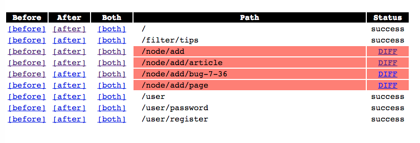

  <h2 style="margin:30px auto 50px 0px; font-size:1.8em; font-weight:bold; width: 90%; text-align: center">
    Test Driven Drupal Upgrades
  </h2>
  <table style="width: 90%"><tr>
    <td style="font-size:0.7em; text-align: center; width:50%;">
      
Alex Dergachev

      
 alex@evolvingweb.ca 

      
 github.com/dergachev 

      
 twitter.com/dergachev 

      
 drupal.org/u/evolvingweb 

    </td>
    <td style="font-size:0.7em; text-align: center; width:50%;">
      
Dave Vasilevsky

      
 vasi@evolvingweb.ca 

      
 github.com/vasi 

      
 twitter.com/djvasi 

      
 drupal.org/u/vasi 

    </td>
  </tr></table>

  

--end--

## Outline

* __About us__ (3m)
* __Intro__ (9m)
  * Testing, Minor Updates, Major Core Upgrades
* __Case study__: McGill Courses and Programs D7 (15m)
  * Project description, Challenges, Solutions
  * Tools: Docker, phpunit, SiteDiff
* __Other tools__: behat, CircleCI	(4m)
* __drupal-docker-marriage demo__ (8m)
* __More tools__: git, backups, upgrade path tests (4m)
* __SiteDiff demo__ (8m)

--end--

## About Evolving Web

* Drupal development, consulting and training since 2007
* Very involved with the Drupal community
* Specialties
  * Large, scalable infrastructure and deployments
  * Multilingual content management
  * Apache Solr search interfaces
  * Content import and synchronization
  * Custom theme development
  * Custom module development
  * Search engine optimization for Drupal (SEO)
  * Integration with legacy systems
  * Expert Drupal training
* Based in Montreal, clients in Canada and USA

--end--

--end--

## Drupal training program

* Public: Montreal, Ottawa, Toronto, DC Munich, NJ, NYC, Boston
* Private: Health Canada, Parks Canada, Tourism Quebec, Trent U, McGill U
* Enterprise teams, dev shops, remote

--end--

## About the speakers

* Alex co-founded Evolving Web straight out of undergrad
* Dave was there to show us version control and Linux
* Besides doing Drupal projects since 2008...

--end--

## Minor updates basics

* `git branch UPDATE-DRUPAL-7-37`
* `drush dl drupal-7.37`
* commit to
* run tests (manual and automatic)

--end--

## Major upgrades basics

* prepare in D6:
  * cleanup, fix bugs, defeaturize
* `git branch UPGRADE-DRUPAL7`
* `drush dl drupal`

--end--

## Testing basics

* Unit testing
  * simpletest (d7), phpunit (d8, can use with D7)
  * fast, great for testing functions with specific inputs/outputs
  * Fixtures
  * Dependency injection (mocks)
  * Limitations: architecture, coverage
* Integration testing
  * simpletest
  * behat
  * selenium
  * slow, brittle
* sitediff
* Upgrade path testing
  * fixture: d6 db structure + data, resulting d7 upgraded data

--end--

## Case Study of a D7 upgrade

* Project description
* Challenges
* Solutions
* Tools
  * Docker
  * phpunit
  * SiteDiff

--end--

## Case study D7 upgrade

* McGill University's Course Calendar (aka Catalogue)
* Programs, Courses, and University Regulations
* Legal documents, course schedules, metadata, cross-referencing
* Search-driven UI

--end--

## Search-driven UI

* tabs (heirarchical facets)
* custom facets
* indexing embedded content (via node refs)
* search this section (menu item)
* performance

--end--

## Logically nested menus

* all data lives in logical tree hierarchy
* think 10k primary link items LOGICALLY, but really the tree is defined by biz logic
* menus (custom code, core, menu_block)
* breadcrumbs, context, flattening

--end--

## Many records, complex structure

* 70k node revisions PER YEAR; most imported from banner+documentum
* 15 content types, 170 field instances
* cross-linking via node reference fields
* incomplete i18n implementation
* web services
* input filters (auto-detection of course names in any HTML content)

--end--

## Hard to upgrade

* Custom modules
  * Legacy => really really custom, with 4 years of cruft
  * Extended apachesolr 6.x-2.x-dev
* Concern about data and configuration integrity
  * Legal requirement that data shown must be correct and complete
* Deliverable = upgrade script, not code + db dump
  * Must be able to re-run on prod database
  * Must also be adaptable for 4 previous years (separate DBs)
* Limited time and resources: 2 devs, 12 weeks

--end--

## ... easier than expected

* Around 20-30 contrib modules
* No auth users except admins
* Little dynamic content except via import scripts
* Evolving Web wrote the original code
* Disciplined client, no scope creep: only upgrade, no new features

--end--

## Surprise complexity

* Defeaturization
* Deploying a dev site (not the same as prod?)
  * had to deduce which contrib modules enabled, version
  * missing content types, modules, blocks;
  * these were defined in proprietary code not shared with us
* performance
  * content migrate running time... measured in days
  * prune the database (10% of the nodes, focused on 1 faculty, try to keep consistency)
  * content_migrate_tweaks https://github.com/dergachev/content_migrate_tweaks
* git branch hecticness
* i18n_field allowed_values translation bug
* misc migration bugs (entityreference, nodeblock)

--end--

## Technical solutions

* Refactoring first for sanity
* Docker for build process automation
* Unit tests for the new code we write; phpunit for filters and menus
* Sitediff for correctness
* Content migrate tweaks for speed
  * [https://github.com/dergachev/content\_migrate\_tweaks](/https://github.com/dergachev/content_migrate_tweaks/)
  * content\_migrate (submodule of CCK) is slow (~2 days)
  * one field record (delta) at a time, one node at a time, one value at a time
  * replaced with INSERT ... SELECT ... queries as >100x optimization
  * validated with table checksums, sitediff
* unit and integration testing
* Search API

--end--

## Unit testing

* phpunit tests per custom module (works with D7 "OK")
  * sometimes had to bootstrap drupal
  * can't mock/swap drupal functions, need process isolation
  * use fixtures and mocks in your tests of custom code that allows dependency injection
* autoloading: tried composer, manually, PSR0; settled for manually
* fixtures were great for menu trees and nodes

--end--

## Scripted upgrade process

* D6 deploy script
* d6 refactor adjustments
* d6 prepare (defeaturize, turn off non-core modules, change theme to bartik, pm-uninstall several modules)
* core updb
* enable modules, run contrib updb
* content migrate
* [menu\_adjustments.php](https://github.com/evolvingweb/coursecal-d7/blob/d7/build/upgrade/menu_adjustments.php)
* [d7\_adjustments.sh](https://github.com/evolvingweb/coursecal-d7/blob/d7/build/scripts/d7_adjustments.sh)
* [d7\_adjustments\_solr.sh](https://github.com/evolvingweb/coursecal-d7/blob/d7/build/scripts/d7_adjustments_solr.sh)
* all glued together by Makefile and multiple Dockerfile-s

--end--

## Content migrate tweaks

--end--

## What is Docker?

* tool that automates the creation and running of VMs for dev and prod
* not a webservice, but a tool that runs on your machine

--end--

## How Docker works

* VMs vs containers: light-weight, shared resources and kernel
* need to run on Linux, or in a Virtualbox VM
* Dockerfile: start from generic "ubuntu:14.04" container, convert to your drupal project
* Definition: image vs container

--end--

## Advantages of Docker

* spin up dev env quickly, great for onboarding
* consistency (all dependencies are the same for all team members)
* easier to replicate bugs
* opportunity for CI (circle CI)
* build process: Dockerfile
* caching
* includes C libraries (yaml), and also tomcat, solr, memcache, APC, xhprof, xdebug, etc ...
* everyone and and their dog is considering it
* easily share images

--end--

## Caveats

* we haven't made it industrial-grade yet
* lots of best practices to figure out, but the costs are up-front
* manual adaptation to new site

--end--

## Docker commands

* docker build -t marriage .
* docker run -it marriage /bin/bash
* docker run marriage start.sh
* docker run -p 8080:80 marriage start.sh
* docker run -v /home/alex/source:/drupal marriage start.sh

--end--

## Docker tutorial / demo

* [https://github.com/dergachev/drupal-docker-marriage/](https://github.com/dergachev/drupal-docker-marriage/)

--end--

## Docker for build process

* instantly spin-up of container (lightweight VM) with EXACT dev environment
* easily script build of container
* smart caching FTW!
* sipmlicity (vs chef): just know bash
* copy on write - instant snapshots
* Makefile

--end--

## How we used Docker

* deployment in separate repo - see [README.md](https://github.com/evolvingweb/allseen-deploy)
* deploy.sh
* Dockerfile
* Makefile

--end--

## SiteDiff

* [github.com/dergachev/sitediff](https://github.com/dergachev/sitediff)
* show pretty diffs of HTML contents of whole sites
* sanitization - easy to write! easy to maintain!
* History: buyandsell
* Compares sites HTML, one page at a time
* Spurious diffs: needs sanitization rules
** Several types
** Some are common for Drupal, eg: form build IDs
* Demo with 7.36 bug?
* Limitations
** JavaScript
** Dynamic content
** Admin UI
* Case study: AllSeen DevDocs
** Drupal vs non-Drupal, migration
** Easy to generate the sitemap automatically
** Needed heavy sanitization
** Caught useful bugs: HTML entity issues, bad quoting
** Good on updates to migration source, we could verify that changes to site matched changes to source

--end--

## SiteDiff Input

        paths:
         - /
         - /user

        selector: 'body'

        sanitization:
        - title: 'remove form build id'
          pattern:    '<input type="hidden" name="form_build_id" value="form-[a-zA-Z0-9_-]+" *\/?>'
          substitute: '<input type="hidden" name="form_build_id" value="__form_build_id__">'

        before:
          dom_transform:
          - type: remove
            selector: '#something'

--end--

## SiteDiff output

--end--

## UI tests

TODO: behat

--end--

## Continuous integration

TODO: CircleCI

--end--

## Docker, behat, CircleCI demo<a onclick="$.deck('go', $('#sitediff-demo')[0].closest('section')['id']);">&nbsp;</a>

https://github.com/evolvingweb/drupal-docker-marriage

<a onclick="$.deck('go', $('#sitediff-demo')[0].closest('section')['id']);">foo</a>

--end--

## Version control<a onclick="$.deck('go', $('#sitediff-demo')[0].closest('section')['id']);">&nbsp;</a>

TODO: git

--end--

## Backups<a onclick="$.deck('go', $('#sitediff-demo')[0].closest('section')['id']);">&nbsp;</a>

TODO

--end--

## Upgrade path tests<a onclick="$.deck('go', $('#sitediff-demo')[0].closest('section')['id']);">&nbsp;</a>

TODO

--end--

## SiteDiff demo
<a id="sitediff-demo" />

https://github.com/vasi/sitediff-update-demo

--end--

## Any questions?

* Evolving Web: [http://evolvingweb.ca](http://evolvingweb.ca)
* SiteDiff: [https://github.com/evolvingweb/sitediff](https://github.com/evolvingweb/sitediff)
* Demo of SiteDiff: [https://github.com/vasi/sitediff-update-demo](https://github.com/vasi/sitediff-update-demo)
* Demo of docker, behat, CircleCI: [https://github.com/evolvingweb/drupal-docker-marriage](https://github.com/evolvingweb/drupal-docker-marriage)
